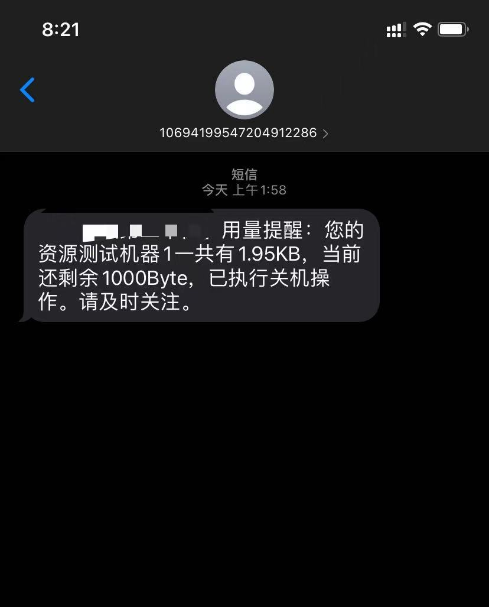
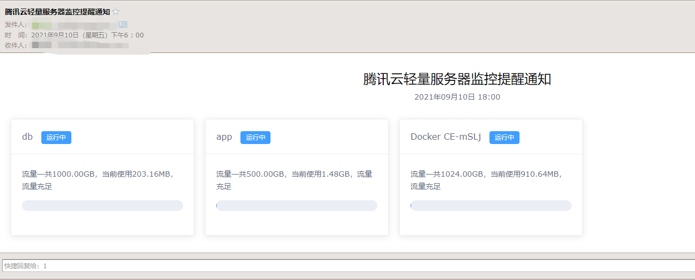
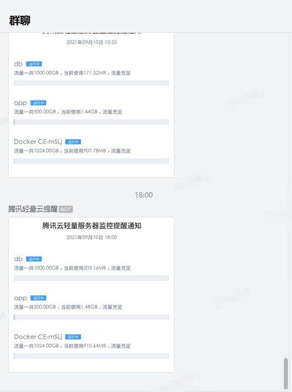

### 一个简单的用腾讯云函数监控轻量服务器流量自动关机开机的程序

**目前支持的特性有**

- [x] 流量超过指定阈值的时候，如果是开机状态就自动关机
- [x] 流量低于配置阈值的时候，如果是关机状态就自动开机 
- [x] 可以设置在指定的时间发送流量使用情况
- [x] 目前支持的报警通道有企业微信、短信(腾讯云短信)以及邮件

**高颜值通知**

**使用方法**

监控程序中需要的参数都是以环境变量的方式传入，目前支持的环境变量有

|名称|值|是否必填|备注|
|---|---|---|---|
|SECRET_ID|腾讯云的SecretID|是|需要有对轻量服务器的全部操作权限，如果需要短信通知，则也需要有云短信的全部权限|
|SECRET_KEY|腾讯云的SecretKey|是|同上|
|THRESHOLD|开关机阈值|否，默认为90|1-100|
|NOTICETYPE|通知类型|是|可以是email、sms、qywx，如果需要多个通知，用逗号隔开，例如email,qywx|
|REPORTTIME|报告时间|否，默认为8|发送流量使用情况的时间，值为0-23，只能是整数|
|RUNINTERVAL|运行间隔|否，默认为60|在腾讯云上设置的云函数运行的间隔，单位是分钟|
|AUTOSTART|自动开机|否，默认为false|如果设置为true，当使用流量低于阈值时，如果服务器是关机状态，则自动开机|
|EMAIL_SMTPSERVER|邮件SMTP服务器地址|否|如果NOTICETYPE包含email，则此项必填|
|EMAIL_SMTPPORT|邮件SMTP端口|否|同上|
|EMAIL_SENDER|发送者邮箱|否|同上|
|EMAIL_RECEIVER|接收者邮箱|否|同上|
|EMAIL_PASSWORD|发送者账号密码|否|同上|
|QYWX_KEY|企业微信机器人Webhook地址的key值|否|如果NOTICETYPE包含qywx，则此项必填|
|SMS_APPID|应用ID|否|腾讯云短信服务应用ID,如果NOTICETYPE包含sms，则此项必填|
|SMS_REGION|区域|否|腾讯云短信服务所在区域,如果NOTICETYPE包含sms，则此项必填|
|SMS_SIGNNAME|签名|否|腾讯云短信服务签名(非签名ID),如果NOTICETYPE包含sms，则此项必填|
|SMS_TEMPLATEID|模板ID|否|腾讯云短信模板ID,如果NOTICETYPE包含sms，则此项必填|
|SMS_SUBSCRIBE|订阅的事件|否|可以选择的订阅的事件有开机、关机、流量统计，指定多个的时候用逗号隔开,如果NOTICETYPE包含sms，则此项必填|
|SMS_RECEIVER|接收短信号码|否|接收用的短信号码，如果NOTICETYPE包含sms，则此项必填|

